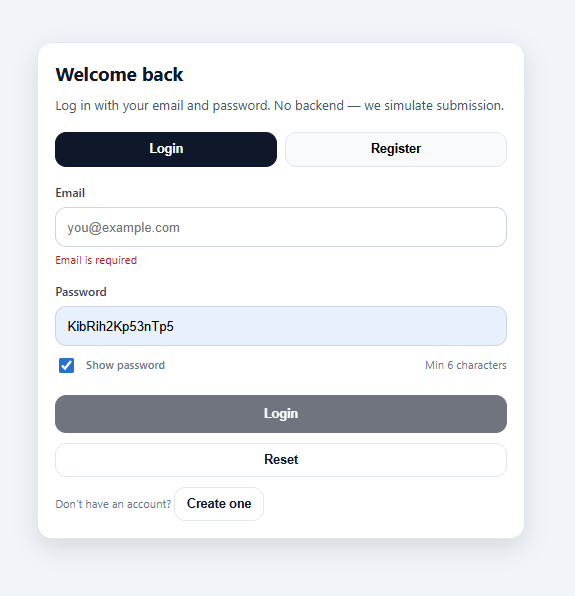
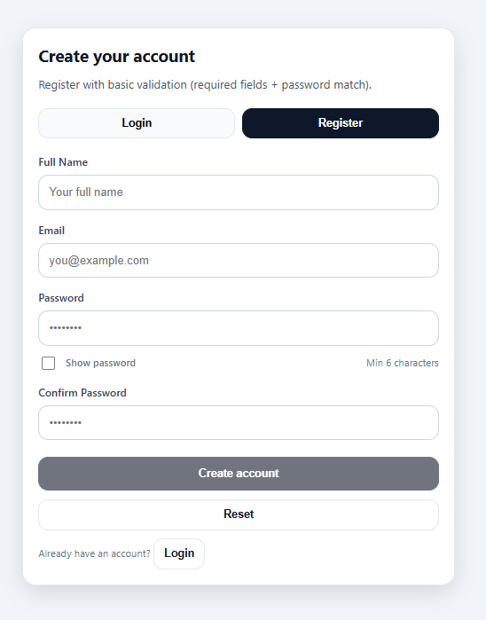

# 🔐 React Login & Registration UI

A clean and responsive authentication UI built with **React**, **React Hook Form**, and **Yup** for form validation.

This project demonstrates client-side form validation, password visibility toggle, tab switching between Login and Register forms, and simulated form submission (no backend).

---

## 🚀 Features

- ✅ Login & Registration forms
- ✅ Form validation using Yup
- ✅ React Hook Form integration
- ✅ Password visibility toggle
- ✅ Confirm password matching
- ✅ Reset form functionality
- ✅ Disabled submit button when invalid
- ✅ Clean responsive UI
- ❌ No backend (console log simulation only)

---

## 🛠️ Tech Stack

- React
- React Hook Form
- Yup
- CSS (custom styling)

---

## 📂 Project Structure
```
src/
│
├── components/
│ ├── LoginForm.jsx
│ └── RegisterForm.jsx
│
├── validations/
│ ├── loginSchema.js
│ └── registerSchema.js
│
├── assets/
│ ├── login.png
│ └── register.png
│
├── App.jsx
├── main.jsx
└── styles.css
```

---

## 📸 Screenshots

### 🔑 Login Page



---

### 📝 Registration Page



---

## ▶️ Getting Started

### 1️⃣ Clone the repository

```bash
git clone https://github.com/your-username/your-repo-name.git
cd your-repo-name
```
### 2️⃣ Install dependencies
```
npm install
```
### 3️⃣ Run the development server
```
npm run dev
```

---

## 🧠 Validation Rules
### Login

Email: required & must be valid format

Password: required & minimum 6 characters

### Register

Full Name: required

Email: required & valid format

Password: required & minimum 6 characters

Confirm Password: must match password

---
## 📌 Notes

This project does not connect to a backend.

On submission, form data is logged to the browser console.

Success messages are shown after valid submission.

---

## 📜 License

This project is open-source and available for learning purposes.
